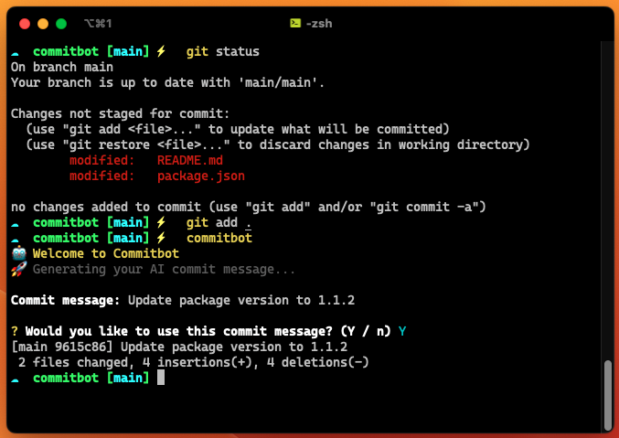

  

    
    <h1 align="center">Commit Bot</h1>
  

	
Say goodbye to writing Git commit messages with this AI-powered CLI. Let the tool do the work for you and never stress about crafting a commit message again. Simply run the command and receive an optimized message that accurately describes your changes. Save time and focus on what matters most - your code.

	
  

---

## Installation and Usage

Simply install the tool with npm, set your [OpenAI key](https://openai.com/api/) and add it as an env variable with the two commands below.

1. `npm install -g commitbot`
2. `export OPENAI_KEY=sk-xxxxxxxxxxxxxxxx`

To ensure persistence, we recommend adding your OpenAI key as an environment variable in your `.zshrc` or `.bashrc` on line #2 file. Once configured, generating a commit message is as easy as running the `commitbot` command.

> Note: If you get a EACCESS error on mac/linux when running the first command, try running it with `sudo npm install -g commitbot`.

## How it works

CommitBot uses OpenAI's GPT-3 to generate commit messages by analyzing your `git diff`. Please note that GPT-3 generations are not free, however, OpenAI offers $18 worth of free credits and commit message generations are cheap, making CommitBot an affordable solution.

## Limitations

At present, CommitBot supports Git diffs of up to 200 lines of code and does not support conventional commits. However, version 2 of the CLI, set to release soon, will address these limitations, adding new features such as the ability to troubleshoot OpenAI responses, enable conventional commits as a flag, support diffs greater than 200 lines, and more.

## Future tasks

As I continue to improve CommitBot, I am excited to offer an upcoming video tutorial that demonstrates how to easily build your own CLI tools powered by AI. Keep an eye out for the 2.0 launch and stay up to date on all the latest features.
